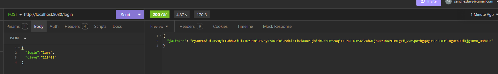
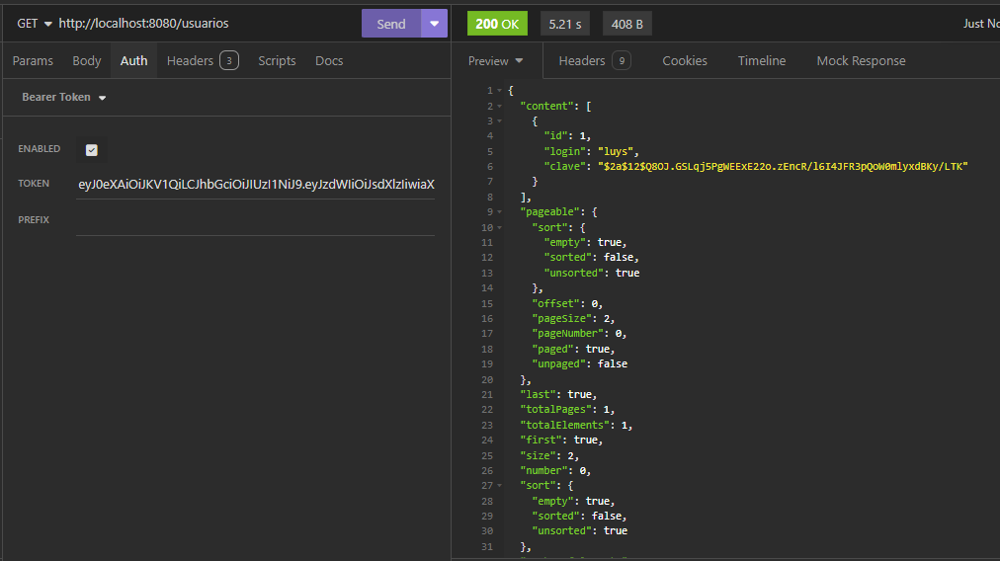
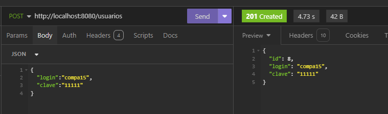
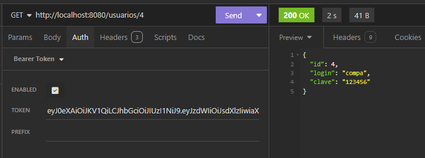
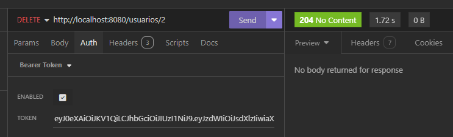
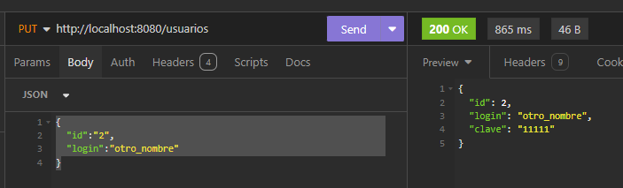
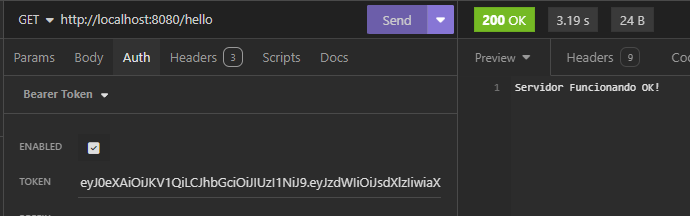
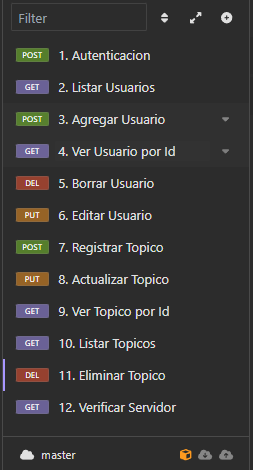

# <h1>Challenge Foro Hub</h1>

proyecto: <h2>spring-boot-3</h2>

 

<ol>
  <li>Aprenda a aislar código de reglas de negocio en una aplicación</li>
  <li>Implemente princípios SOLID</li>
  <li>Documente una API seguindo el protocolo OpenAPI</li>
  <li>Aprenda a escribir pruebas automatizadas en una aplicación con Spring Boot</li>
  <li>Realize el build de una aplicação con Spring Boot</li>
  <li>Use variables de entorno/ambiente y prepare una aplicación para su implementación/deploy</li>
</ol>

links

1) dependencias 
<a>https://www.postman.com/</a> 
<a>https://spring.io/projects/spring-boot</a> 
<a>https://www.aluracursos.com/</a> 

### Tecnologías aplicadas

| Item | Nombre               | Usos |
|------|----------------------|------|
| 1    | Lombok               |      |
|      |                      |      |
| 2    | Spring Web           |      |
|      |                      |      |
| 3    | Spring Boot DevTools |      |
|      |                      |      |
| 4    | Spring Data JPA      |      |
|      |                      |      |
| 5    | Flyway Migration     |      |
|      |                      |      |
| 6    | MySQL Driver         |      |
|      |                      |      |
| 7    | Validation           |      |
|      |                      |      |
| 8    | Spring Security      |      |

2) ide 
<a href="https://www.jetbrains.com/idea/promo/?msclkid=c934a6edeb2510614d26c2af04a86b25&utm_source=bing&utm_medium=cpc&utm_campaign=AMER_en_BR_IDEA_Branded&utm_term=intellij&utm_content=intellij%20idea">Descarga Intellij</a>
 

### Payload para el login
    {
        "login":"luys",
        "clave":"123456"
    }

#### Se usa Bcrypt https://bcrypt-generator.com/
    En la BD MySQL:
    login: luys
    clave: $2a$12$Q8OJ.GSLqj5PgWEExE22o.zEncR/l6I4JFR3pQoW0mlyxdBKy/LTK

## Endpoints de la API

### 1. POST: /login   Autenticación

### 2. GET: /usuarios    Ver Listado de Usuarios

### 3. POST: /usuario    Agregar Usuario

payload:

    {
        "login":"nombre_usuario",
        "clave":"clave_usuario"
    }

### 4. GET: /usuarios/{id}  Ver un Usuario Por Id

### 5. DELETE: /usuarios/{id}  Borrar Un Usuario por Id

### 6. PUT: /usuarios   Editar Usuario

payload:

    {
        "id":"2",
        "login":"otro_nombre"
    }
    

### 7. POST: /topicos   Agregar Un nuevo Topico

### 8. PUT: /topicos   Actualizar un topico

### 9. GET: /topicos   Listar todos los Topicos

### 10. DELETE: /topicos/{id}   Borrar un Topico

### 11. GET: /hello    Verificar que este funcionando el servidor

## Documentacion de la API

http://localhost:8080/swagger-ui/index.html

## Diagrama Entidad Relación

## Configuración Insomia

## Mejoras y Bugs pendientes por corregir

| Item | Tipo   | Descripción                                          | Propuesta      |
|------|--------|------------------------------------------------------|----------------|
| 1    | Bug    | No guarda la clave encriptada en los nuevos usuarios | revisar código |
|      |        |                                                      |                |
| 2    | Mejora | Que solo liste los usuarios activos                  |                |
|      |        |                                                      |                |
| 3    | Mejora | Mejorar los mensajes en cada respuesta de la API     |                |
|      |        |                                                      |                |
|      |        |                                                      |                |
|      |        |                                                      |                |
|      |        |                                                      |                |
